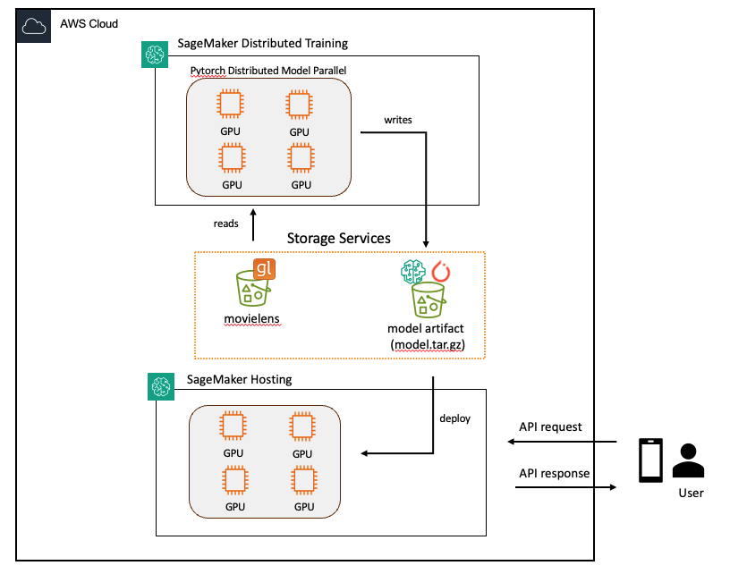

# Distributed Training and Inference with Pytorch, MLFlow and Amazon SageMaker AI

In this workshop, you will go through the steps required to build a machine learning application on AWS using Pytorch, Amazon SageMaker AI. 

[//]: # (You will learn how to start experimentation in the SageMaker Studio environment using a familiar JupyterLab notebook experience and run your a SageMaker Training job. You will also learn how to deploy the model into an endpoint and build a complete training pipeline. You will also learn how to setup shadow testing to run a production and a shadow model variant behind the same endpoint)

### Modules and learning objectives
* **00 - Introduction:** Perform prerequisites and validations using a SageMaker Studio Jupyterlab notebook for the labs.
* **01 - Build a Two Tower recommender model:** Perform data preparation using the SageMaker Studio Jupyterlab notebook experience and trigger a SageMaker Training job. MLflow will be used to track and observe the experiments.
* **02 - Deploy a Two Tower recommender model:** You will learn to use a SageMaker Studio Jupyterlab notebook to deploy the model into an endpoint.
* **03 - Shadow Testing:** You will learn to setup a shadow testing using SageMaker SDK and deploy 2 models behind a single endpoint, and run test and analyze the results.

## Amazon SageMaker AI

Amazon SageMaker AI is a fully-managed service that enables developers and data scientists to quickly and easily build, train, and deploy machine learning models at any scale.

Amazon SageMaker removes the complexity that holds back developer success with each of these steps; indeed, it includes modules that can be used together or independently to build, train, and deploy your machine learning models.

## The machine learning task

You will use the [Movielens Dataset](https://movielens.org/) from Grouplens to train a two tower recommender model. The dataset contains real and synthetic data that represents users,  movies/shows and the corresponding ratings for large number of movies. The dataset ranges between 10k to 32 million records, making it suitable for training a recommender model. 

In this workshop, your goal is to build a two tower recommender model that recommends the movies based on the given preference.

Following is an excerpt from the rating dataset:

All ratings are contained in the file "ratings.dat" and are in the
following format:

UserID::MovieID::Rating::Timestamp

- UserIDs range between 1 and 6040 
- MovieIDs range between 1 and 3952
- Ratings are made on a 5-star scale (whole-star ratings only)
- Timestamp is represented in seconds since the epoch as returned by time(2)
- Each user has at least 20 ratings
  
The ratings column, is the target target variable, in fact we are transforming the labels into [0,1] based on the individual rating. For instance, if the rating is 4 and above, we consider a movie to recommend a user, if rating is below 4, we consider not to recommend to the user. Based on this assumption, we frame the problem as a binary classification problem. In this workshop, you will build a neural network model, called two tower model. A two-tower model is a neural network architecture that processes two different types of inputs through separate "towers" to generate embeddings in a shared vector space. Each tower independently processes its respective inputs, making it particularly effective for recommendation systems and retrieval tasks. For more information about two tower, please refer to thse papers [here](https://dl.acm.org/doi/abs/10.1145/3366423.3380130), [here](https://dlp-kdd.github.io/assets/pdf/DLP-KDD_2021_paper_4.pdf) and [here](https://arxiv.org/html/2403.00802v1).
During inference, the system only needs to process the query/user features through the query tower to generate the query embedding, and perform similarity search between the query embedding and the pre-computed item embeddings to find the top recommended items. 

Due to potential large number (millions or billions) of user and item interactions, training a two tower model is commonly involves using distributed model and data parallel approach. Using distributed model and data parallel allows large amount of training data to be sharded across GPU nodes, as well as distributing the large embedding tables across these nodes for training efficiency. We are going to leverage an open source framework [TorchRec](https://pytorch.org/torchrec/) to build a Two Tower recommender system.

## Distributed Training and Inference Using SageMaker AI
The end to end architecture for distributed training and inference can be visualized in the following architecture diagram: 

## Running this workshop

### AWS-run event using AWS Workshop Studio
If you are attending the **Distributed Training and Inference with Pytorch, MLFlow and Amazon SageMaker AI** workshop run by AWS, the AWS event facilitator has provided you access to a temporary AWS account preconfigured for this workshop. Proceed to <a href=".00-start-here.ipynb">**Module 0: Introduction**</a>.

### Self-paced using your AWS account
If you want to use your own AWS account, you'll have to execute some preliminary configuration steps as described in the **<a href="./setup/README.md">Setup Guide</a>**.

> :warning: **Running this workshop in your AWS account will incur costs**. You will need to delete the resources you create to avoid incurring further costs after you have completed the workshop. See the [clean up steps](./cleanup/README.md).

## Authors

[Wei Teh](https://it.linkedin.com/in/giuporcelli) - Senior AI/ML Specialist Solutions Architect - Amazon Web Services 
[Asim Jalis](https://www.linkedin.com/in/asimjalis) - Senior AI/ML/Analytics Solutions Architect - Amazon Web Services  
[Eddie Reminez](https://www.linkedin.com/in/eddie-ramirez/) - Senior Solutions Architect - Amazon Web Services  
[Jared Sutherland](https://www.linkedin.com/in/jaredsutherland/) - Senior Solutions Architect - Amazon Web Services  
[Vivek Gangassani](https://www.linkedin.com/in/vivekgangasani/) - Senior Generative AI Specialist Solutions Architect - Amazon Web Services 
